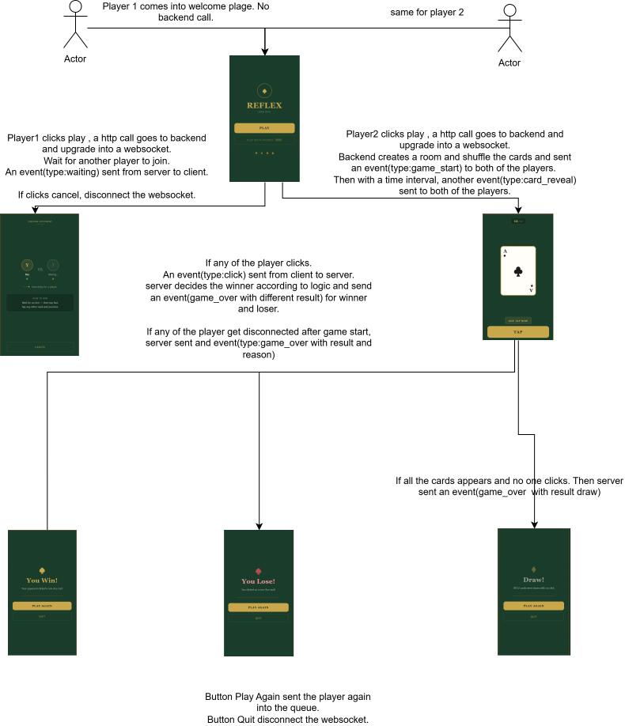

# reflex-card-game-backend

Real-time WebSocket backend for **Reflex** — a two-player card reaction game built in Go.

[](https://go.dev)
[](https://datatracker.ietf.org/doc/html/rfc6455)
[](./Dockerfile)

---

## Table of Contents

- [Game Rules](#game-rules)
- [How to Run](#how-to-run)
- [Live App](https://reflex-card-game-frontend.vercel.app)
- [API Documentation](#api-documentation)
- [Tech Stack & Design Decisions](#tech-stack--design-decisions)
- [Configuration](#configuration)
- [Design Flow](#design-flow)

---

## Game Rules

1. Two players connect to the server — they are automatically paired.
2. Once paired, a shuffled 52-card deck is dealt on the server.
3. Cards are revealed to both players simultaneously, one every `CARD_INTERVAL_MS` milliseconds.
4. **Players must wait for an Ace.** Clicking any non-Ace card results in an immediate loss.
5. When an Ace appears, the **first player to click wins** the game.
6. If all 52 cards are revealed with no click from either player, the game ends in a **draw**.
7. If a player disconnects mid-game, their opponent wins.

---

## How to Run

### Prerequisites

- Go 1.25.5
- Docker (optional)

### Clone & Run Locally

```bash
git clone git@github.com:shn27/reflex-card-game-backend.git
cd reflex-card-game-backend

cp .env.example .env   # configure your environment

go mod tidy
go run main.go
```

The server starts on `http://localhost:8080`.

### Docker

```bash
# Build
docker build -t reflex-backend .

# Run
docker run -p 8080:8080 --env-file .env.example reflex-backend
```

The Dockerfile uses a multi-stage build. The final image is based on `scratch` — no OS, no shell, just the compiled binary.

### Frontend

See the [reflex-card-game-frontend](https://github.com/shn27/reflex-card-game-frontend) repository for setup instructions, or visit the live app:

**[reflex-card-game-frontend.vercel.app](https://reflex-card-game-frontend.vercel.app)**

---

## API Documentation

### Endpoints

```
WS   ws://localhost:8080/ws     Main game endpoint
GET  http://localhost:8080/health    Returns 200 OK
```

Connect to `/ws` to join the matchmaking queue. No authentication or query parameters are required — the act of connecting is the join.

---

### Server → Client Messages

#### `waiting`
Sent to the first player while they wait for an opponent.

```json
{
  "type": "waiting",
  "message": "Waiting for an opponent…"
}
```

---

#### `game_start`
Sent to both players once a match is found. Each player receives their own `player_id`.

```json
{
  "type": "game_start",
  "player_id": 1
}
```

| Field | Type | Values |
|---|---|---|
| `player_id` | int | `1` or `2` |

---

#### `card_reveal`
Sent to both players every `CARD_INTERVAL_MS` milliseconds. Both players always see the same card at the same time — the deck lives on the server.

```json
{
  "type": "card_reveal",
  "card": {
    "rank": "A",
    "suit": "hearts"
  },
  "card_index": 14
}
```

| Field | Type | Description |
|---|---|---|
| `card.rank` | string | `A`, `2`–`10`, `J`, `Q`, `K` |
| `card.suit` | string | `hearts`, `diamonds`, `clubs`, `spades` |
| `card_index` | int | 1-based position in the deck, `1`–`52` |

---

#### `game_over`
Sent to both players when the game ends for any reason. `result` is always from the **receiving player's perspective**.

```json
{
  "type": "game_over",
  "result": "win",
  "reason": "You clicked the Ace first!",
  "winner_id": 1,
  "card": {
    "rank": "A",
    "suit": "hearts"
  }
}
```

| Field | Type | Values | Notes |
|---|---|---|---|
| `result` | string | `win` \| `lose` \| `draw` | From the receiving player's perspective |
| `reason` | string | — | Human-readable explanation for the UI |
| `winner_id` | int | `1`, `2` | Absent on a draw |
| `card` | object | — | The card that ended the game; absent on a draw |

**All possible outcomes:**

| Scenario | Clicker receives | Opponent receives |
|---|---|---|
| Clicked an Ace first | `win` | `lose` |
| Clicked a non-Ace | `lose` | `win` |
| Opponent disconnected | `win` | — |
| All 52 cards, no clicks | `draw` | `draw` |


---

### Client → Server Messages

#### `click`
Sent when the player clicks the button. The server validates whether the current card is an Ace and resolves the game.

```json
{
  "type": "click"
}
```

Clicks sent before the first card is revealed, or after the game has already ended, are silently ignored.

---

## Tech Stack & Design Decisions

### Language — Go

Go's goroutine model maps naturally onto this problem: each connected player gets a dedicated read goroutine and shares a write channel, with all coordination done through mutexes and channels. The result is straightforward concurrent code without callback chains.

The standard library covers everything needed — `net/http`, `sync`, `time`, `encoding/json`. There is no framework tax.

### WebSocket — gorilla/websocket

`gorilla/websocket` is the established standard for WebSocket in Go. It handles frame parsing, ping/pong keepalives, and enforces the single-writer constraint. The read/write pump pattern (one goroutine each, communicating via a channel) comes directly from its documentation and is widely understood in the Go community.

### HTTP Router — `net/http` (stdlib)

The server exposes exactly two routes: `/ws` and `/health`. Reaching for Gin or Chi for two routes would be engineering overhead with no measurable benefit.

### Logger — Zap

Zap's structured, zero-allocation logging is well suited to a server that logs on every card reveal and every player event. Structured fields (`zap.String`, `zap.Int`) make logs machine-parseable without additional tooling — useful when shipping logs to an aggregator in a containerised environment.

### `Sender` Interface

The `game` package defines a minimal interface:

```go
type Sender interface {
    Send(msg OutMessage)
}
```

`ws.Client` implements it, but `game` never imports `ws`. This inversion means:

- Game logic can be unit-tested with a mock `Sender` — no real WebSocket needed.
- Swapping the transport layer requires no changes to `game`.

### Single Source of Truth

The server controls everything: deck order, card timing, click validation, and result determination. Clients send only `{ type: "click" }`. There is no client-side game state that could be manipulated.

### No Persistence

Game state lives entirely in memory. There is no database or reconnection logic. A disconnecting player ends the game immediately — appropriate for a reflex game where a seconds-long interruption makes the session unplayable regardless.

---

## Configuration

Copy `.env.example` to `.env` and adjust as needed:

```bash
cp .env.example .env
```

| Variable | Default | Description |
|---|---|---|
| `PORT` | `8080` | HTTP listen port |
| `ALLOWED_ORIGINS` | `*` | Comma-separated allowed WebSocket origins. In production, set this to your frontend URL (e.g. `https://reflex-card-game-frontend.vercel.app`) |
| `CARD_INTERVAL_MS` | `2000` | Milliseconds between card reveals. Minimum enforced: `500` |


---

## Design Flow


